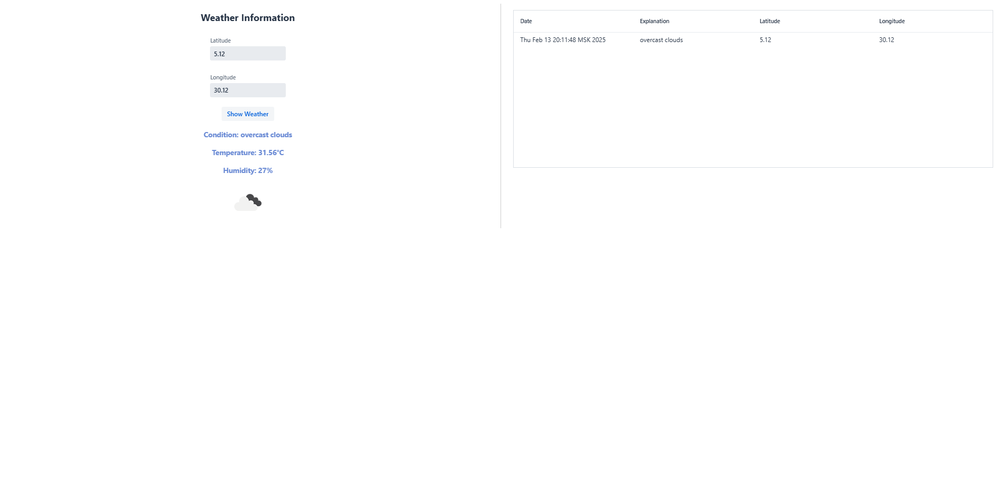
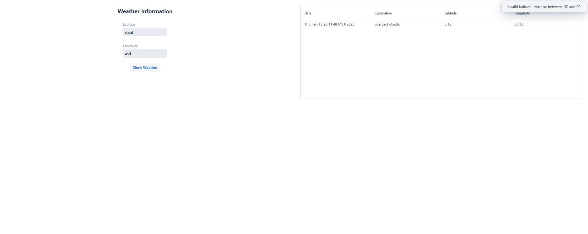

# Тестовое задание

## Запуск

1. В рабочей директории выполните команду:

    ```bash
    docker-compose up -d
    ```

2. Затем запустите приложение с помощью Maven:

    ```bash
    mvn spring-boot:run
    ```

## Скриншоты

### Пример 1:
<div style="display: flex; justify-content: space-between;">
  
</div>

### Пример 2:
<div style="display: flex; justify-content: space-between;">
  
</div>

Для упрощения настройки проекта, я решил захардкодить значение API_KEY внутри кода, однако в реальных условиях было бы разумно вынести этот ключ в отдельную конфигурацию.
